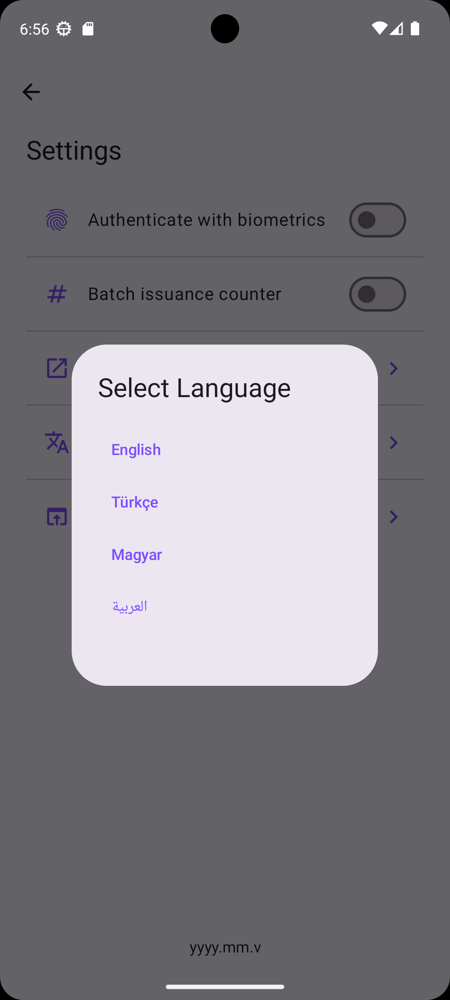
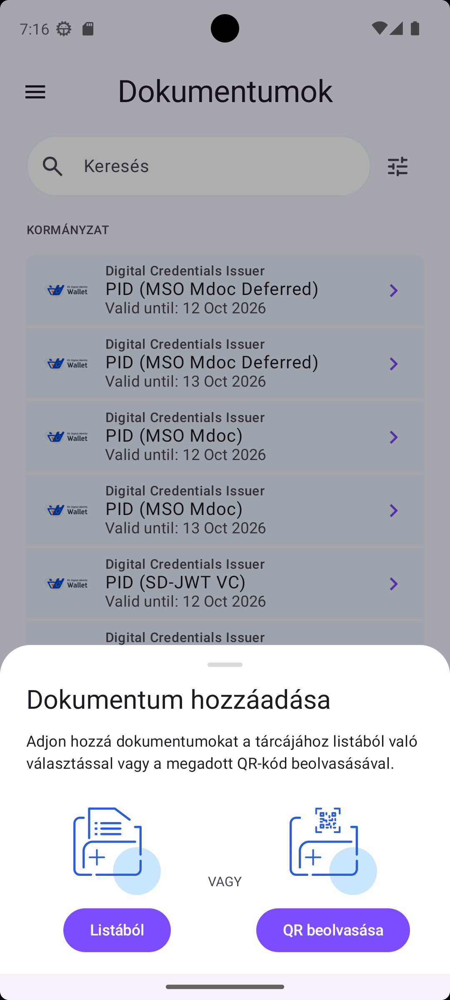
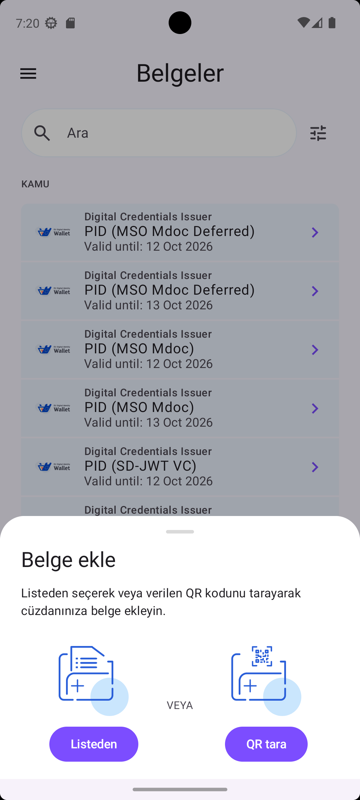
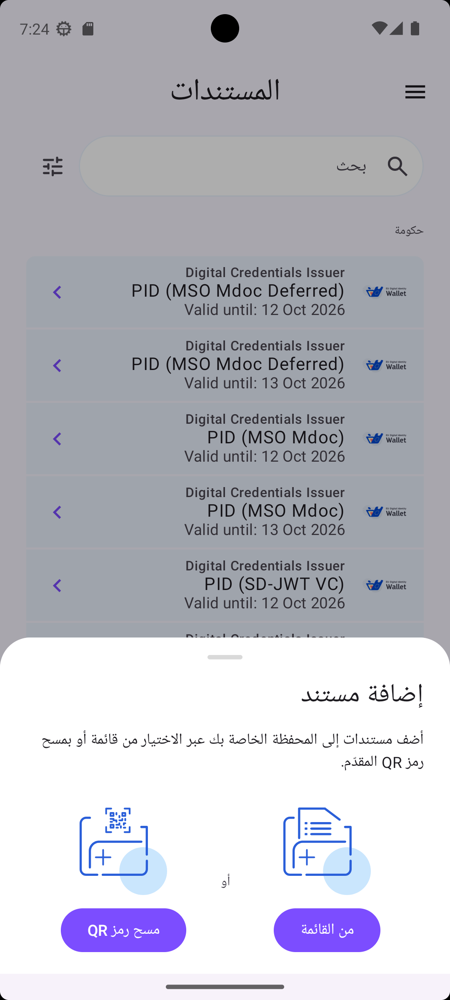

# Localization and Language Selection

## Overview

The EUDI Wallet application originally provided English as the default language and did not include an in-app language selection option.

As part of the project work, a language selection feature was added to the Settings screen.

The application was extended with support for four languages:

- English
- Turkish
- Hungarian
- Arabic

Users can select their preferred language directly from the Settings screen.

---

## Supported Languages

| Language | Android Resource |
|---|---|
| English | `values/` |
| Turkish | `values-tr/` |
| Hungarian | `values-hu/` |
| Arabic | `values-ar/` |

The English resources remain in the default `values/` directory, while the additional languages use separate Android locale-specific resource directories.

**Resource structure:**

    res/
    ├── values/
    ├── values-tr/
    ├── values-hu/
    └── values-ar/

---

## Language Selection in Settings

A new **Language** option was added to the Settings screen.

The option uses the localized resource:

    R.string.settings_screen_option_language

and is represented by the `LANGUAGE` settings menu item.

The corresponding implementation is located in:

`SettingsInteractor.kt`

The Language item uses a translation icon and a navigation arrow to indicate that an additional selection screen is available.

The relevant implementation is:

    SettingsItemUi(
        type = SettingsMenuItemType.LANGUAGE,
        data = ListItemDataUi(
            itemId = SettingsMenuItemType.LANGUAGE.itemId,
            mainContentData = ListItemMainContentDataUi.Text(
                text = resourceProvider.getString(
                    R.string.settings_screen_option_language
                )
            ),
            leadingContentData = ListItemLeadingContentDataUi.Icon(
                iconData = AppIcons.Translate
            ),
            trailingContentData = ListItemTrailingContentDataUi.Icon(
                iconData = AppIcons.KeyboardArrowRight
            )
        )
    )

---
## Opening the Language Selection Dialog

When the Language item is selected, the Settings ViewModel emits a dedicated language dialog effect.

The relevant implementation is located in:

`SettingsViewModel.kt`

The language dialog effect is defined as:

    data object ShowLanguageDialog : Effect()

When the Language settings item is clicked, the corresponding effect is triggered:

    SettingsMenuItemType.LANGUAGE -> {
        setEffect {
            Effect.ShowLanguageDialog
        }
    }

The `ShowLanguageDialog` effect is then handled by `SettingsScreen.kt`.

---

## Language Selection UI

The language selection dialog provides the following options:

- English
- Türkçe
- Magyar
- العربية

The corresponding language codes are:

    English  → en
    Türkçe   → tr
    Magyar   → hu
    العربية  → ar

The language selection UI is implemented in:

`SettingsScreen.kt`

The dialog presents the four supported languages to the user and allows the preferred language to be selected directly from the Settings screen.

---

## Language Persistence

The selected language is stored so that the user's language preference can be restored when the application is opened again.

The language handling logic:

1. Reads the saved language preference.
2. Uses English as the default language when no preference has been saved.
3. Applies the selected locale to the application configuration.
4. Recreates the activity so that the selected locale can be applied.

This logic is implemented in `SettingsScreen.kt`.

The language selection therefore includes both the language selection interface and the logic required to preserve the selected language.

---
## Resource Files

The translations are organized using Android's standard locale-specific resource structure.

### English

    resources-logic/src/main/res/values/strings.xml

### Turkish

    resources-logic/src/main/res/values-tr/strings.xml

### Hungarian

    resources-logic/src/main/res/values-hu/strings.xml

### Arabic

    resources-logic/src/main/res/values-ar/strings.xml

The language option itself is also localized in each resource file.

For example:

| Language | Language option |
|---|---|
| English | `Language` |
| Turkish | `Dil` |
| Hungarian | `Nyelv` |
| Arabic | `اللغة` |

---

## Implementation Files

The main implementation is distributed across the following files:

| File | Purpose |
|---|---|
| `SettingsInteractor.kt` | Adds the Language option to Settings |
| `SettingsViewModel.kt` | Handles the Language menu selection |
| `SettingsScreen.kt` | Displays the language selection dialog and applies the selected language |
| `values/strings.xml` | English resources |
| `values-tr/strings.xml` | Turkish resources |
| `values-hu/strings.xml` | Hungarian resources |
| `values-ar/strings.xml` | Arabic resources |

---
---

## Application Evidence

The language selection feature can be observed directly in the running EUDI Wallet application.

The Settings screen provides a **Select Language** dialog containing the four supported languages:

- English
- Türkçe
- Magyar
- العربية

### Language Selection

These screenshots provide visual evidence of the implemented language selection feature and the added localized resources.